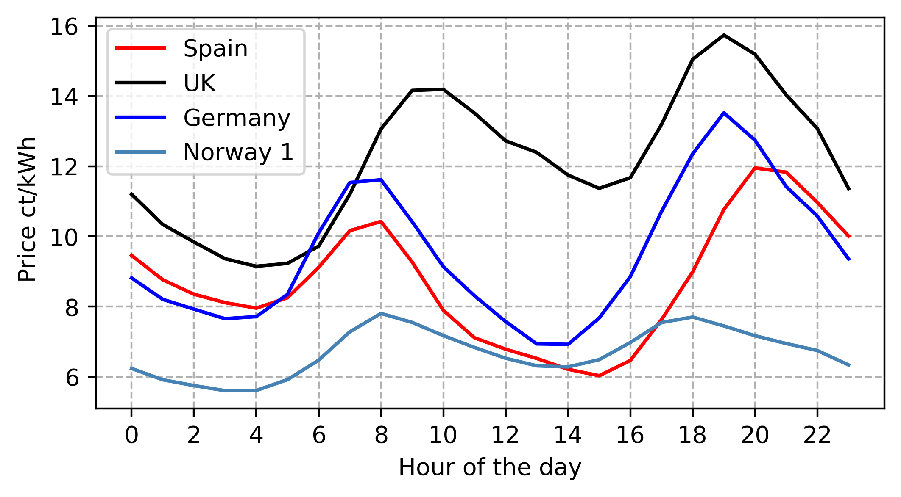

## The main idea
Smart charging can be interpreted in various ways, with different authors providing their own definitions. The central concept is that EV owners have some flexibility in their charging requirements. Typically, an EV might be connected to the electricity grid for a known duration, such as 8 hours from 22:00 to 06:00, while the actual charging time needed is less, for example, only 3 hours. EV owners encounter dynamic electricity prices, which result from electricity auctions in which their electricity retailer participates. With information about the auction's price outcomes, the charging times of the EV can be scheduled to achieve specific goals, such as minimizing electricity costs.

This brief description covers the main idea of smart charging. The following sections delve deeper into the **design of the electricity market**, the technical characteristics of the **electricity grid**, and the **EV owner's capacity to offer flexibility**. We will explore these three components in the upcoming sections.

## Design of the Electricity Market

Electricity can be traded on various power exchange markets, across different bidding zones, and for different time slots. Most smart charging applications focus on the day-ahead market. In this market, both electricity producers and consumers can submit bids for each hour of the next trading day.  Due to practical constraints, private households typically do not place bids directly. Instead, they usually have a contract with an aggregator or a local power company. This entity handles the electricity purchasing on behalf of its customers. They use consumption forecasts to determine the amount of electricity needed and buy it in bulk for all their clients. Electricty producer submit bids specifying the amount of electricity they will produce, the price for that amount, and the hour of delivery. Consumers submit bids in a similar format, but their goal is to buy electricity, not produce it.

Bids must be submitted before the gate closure time, which is typically around noon. After this time, the power exchange determines the demand curve from consumer bids and the supply curve from producer bids for each delivery period. The point where these curves intersect is the market clearing price, which applies to all accepted buy and sell orders. Buy orders with prices at or above the market clearing price are accepted, as are sell orders with prices at or below it. This ensures transparency and fairness for all market participants.

Once the market results are confirmed, all accepted buy and sell orders become binding transactions, which are then cleared and settled by the clearing service providers. The image below illustrates this clearing process.

The blue blocks represent electricity producer bids, where the height indicates the price they are willing to accept and the width represents the amount of electricity they are willing to produce. Together, these blocks form the supply curve, which shows the relationship between supply and price.

The green blocks represent consumer bids, with the height indicating the price they are willing to pay and the width representing the amount they want to purchase. Combined, these blocks form the demand curve, which shows the relationship between demand and price.

The point where these two curves intersect (indicated by the yellow lightning bolt) is called the equilibrium. At this point, the market clearing price is determined, balancing supply and demand. The same amount of electricity is sold by producers as is bought by consumers.

All supply bids with prices below the equilibrium price are accepted, as are all demand bids with prices at or above the equilibrium price. Consequently, all producers receive at least the price they were willing to accept, and all consumers pay no more than the price they were willing to pay. This results in an efficient and fair outcome for both parties.

Matching supply and demand occurs for each hour of the day, resulting in 24 distinct market outcomes daily. This means there can be a different price for each hour, influenced by factors such as varying demand (e.g., higher electricity consumption by private households in the morning and evening) and fluctuating supply (e.g., increased solar power on sunny summer days). By leveraging these price differences, a simple smart charging strategy can effectively minimize charging costs.

On average, the electricity price curve exhibits a typical pattern throughout the day: low prices during the night, a price peak in the morning, lower prices during the day, and a second peak in the evening. The image below shows the average prices for different bidding zones for the year 2023. You can see that while all these curves follow the same general pattern, they differ in terms of the magnitude of the price peaks and the overall price level.

## Electricity Grid

The electricity grid is the infrastructure required to transport electrical energy from producers to consumers. Producers feed electricity into the grid, while consumers draw electricity from it. Electricity grids consist of power stations, electrical substations (to step voltage up or down), electric power transmission (to carry power over long distances), and finally, electric power distribution to customers. The combined transmission and distribution network is part of electricity delivery, known as the power grid.

The transmission system transports electricity from producers over long distances at high voltages to transformers, which are connected to local distribution grids. These distribution grids operate at lower voltages and deliver electricity to consumers. Due to the technical nature of an electrical grid, it is not possible to store electricity in the grid itself. Therefore, supply and demand always have to match.

Two major and simple key figures are used when evaluating the performance of an electricity grid: Load Factor and Power Losses.

**Load Factor**: This metric is calculated by dividing the average load by the peak load of the system. It is used to evaluate the load profile for the dimensioning of the system. As the peak load has to be covered (otherwise a blackout occurs), this figure represents average capacity utilization. High peak loads (compared to the average load) necessitate over-dimensioning of the grid, causing capacity to sit idle for long periods. This can be seen by a low load factor.

**Power Losses**: This key figure describes the actual losses in the power system. Due to component resistance and the physical length of the transmission lines, there are unavoidable differences between the energy fed into the grid and the actual energy supplied to end-users. A commonly used approximation is **insert Formula**, where R is the resistance of the power lines, P is the power, and V is the voltage. Resistance and voltage are predetermined by the system through its design. The power in the system varies depending on current production/supply of electricity. As the formula shows, electricity consumption does not always result in the same power losses. Consuming electricity during times of high overall consumption results in far more power losses.

Why should we care about power losses or load factors when thinking about smart charging? Usually, the grid operator covers the financial burden of power losses and passes the bill to customers through grid tariffs. These customers include EV owners. The design of this grid tariff can vary significantly, from fixed monthly fees to variable fees based on actual power consumption during each hour of the day. In a dynamic pricing setting, grid fees are higher during peak load hours and lower during off-peak hours. Here, operational power losses are translated into operational fees, which can then be considered by smart charging applications.

## EV Owner Flexibility

lorem ipsum

